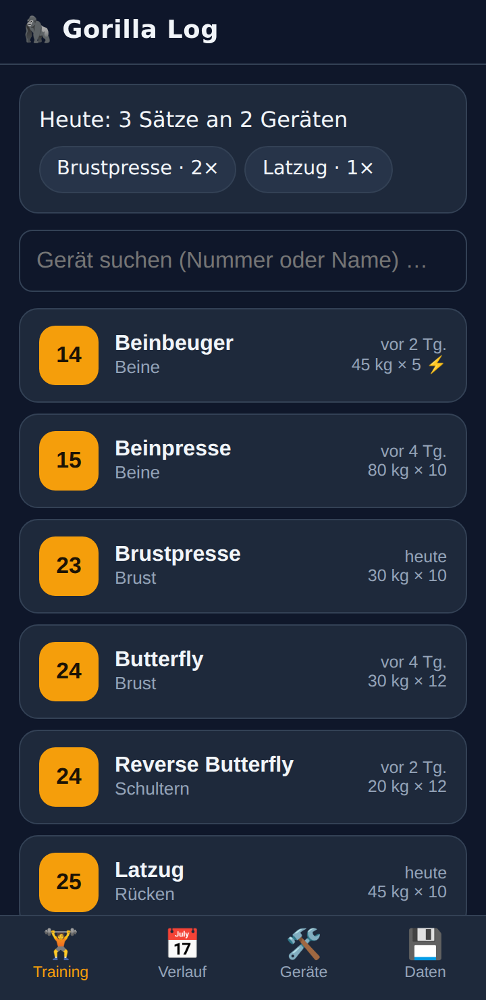
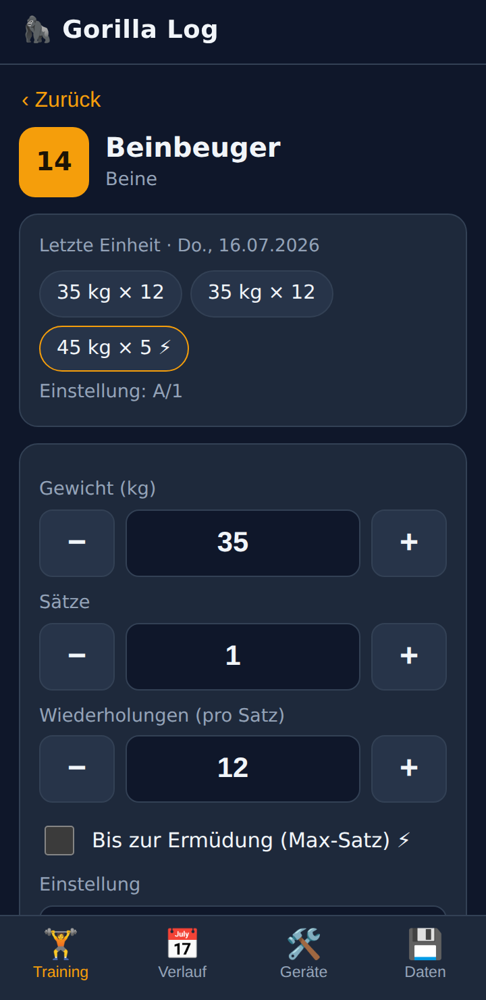
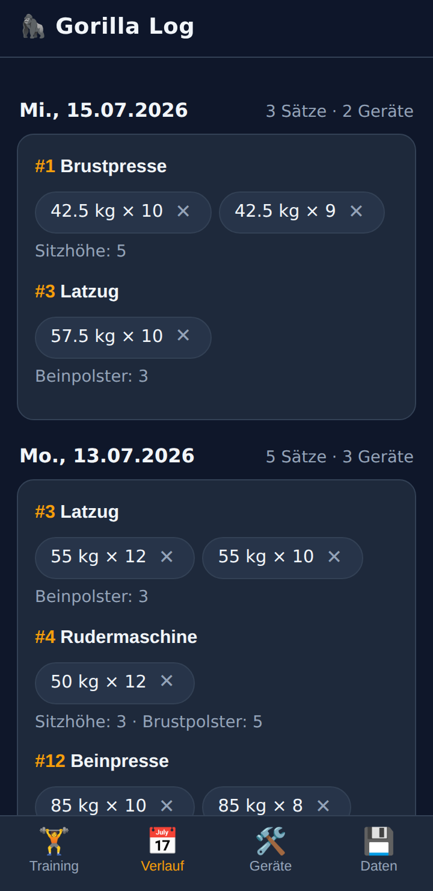

# 🦍 Gorilla Log

Ein schlanker Trainings-Tracker fürs Fitnessstudio – als installierbare,
offline-fähige Web-App. Erfassen, **welches Gerät (Nummer), wie viel Gewicht,
wie viele Wiederholungen und welche Einstellungen** – mehr nicht.

Keine Anmeldung, keine Werbung, keine Cloud: Alle Daten bleiben lokal auf dem
Gerät. Der Code besteht aus reinem HTML/CSS/JavaScript ohne einzige Abhängigkeit.

<p align="center">
  
  
  
</p>

## Funktionen

- **Schnell erfassen:** Gerät per Nummer oder Name suchen, Gewicht, Sätze und
  Wiederholungen mit grossen −/+-Tasten einstellen und mit einem Tipp
  speichern – einzeln oder als Block (z. B. 3 × 10). Die Werte des letzten
  Trainings sind bereits vorbelegt.
- **Letzte Einheit im Blick:** Beim Öffnen eines Geräts erscheinen die Sätze,
  Einstellungen und Notizen vom letzten Mal.
- **Max-Sätze:** Ein Satz „bis zur Ermüdung“ lässt sich per Haken markieren
  und wird überall mit ⚡ gekennzeichnet – klassische Sätze und
  Ermüdungs-Sätze funktionieren nebeneinander.
- **Korrigieren:** Jeden gespeicherten Satz antippen (heute oder im Verlauf),
  Werte ändern, speichern – kein Löschen und Neu-Eintippen nötig.
- **Fortschritt:** Pro Gerät die Entwicklung des Top-Satzes über die letzten
  Einheiten als Balkenübersicht.
- **Trainingspläne:** Mehrere benannte Pläne (z. B. Ganzkörper, Push, Pull)
  mit je eigener Geräte-Reihenfolge; im Training-Tab per Tipp umschaltbar.
  Erledigtes wird grün abgehakt und „Als Nächstes“ führt durch die Einheit.
- **Pausen-Timer (optional):** Auf Wunsch startet nach jedem gespeicherten
  Satz ein 90-Sekunden-Countdown mit Vibration (unter „Daten“ aktivierbar).
- **Cardio:** Geräte mit Muskelgruppe „Cardio“ (Laufband, Fahrrad, Einwärmen)
  erfassen Dauer in Minuten und optional die Distanz in Kilometern statt
  Gewicht, Sätze und Wiederholungen.
- **Geräte-Einstellungen merken:** Pro Gerät frei definierbare Felder wie
  Sitzhöhe oder Rückenlehne – nie wieder die richtige Stufe suchen.
- **Verlauf:** Alle Trainingstage chronologisch, pro Gerät gruppiert.
- **Eigener Gerätekatalog:** Ein Startkatalog ist vorbefüllt; Nummern, Namen,
  Muskelgruppen und Felder lassen sich ans eigene Studio anpassen. Auch
  Übungen ohne Gerätenummer (Freihanteln, Bänder) sind möglich.
- **Backup:** Kompletter Datenbestand als JSON-Datei exportieren und wieder
  importieren.
- **Offline:** Nach dem ersten Öffnen funktioniert die App ohne Internet.

## Installation auf dem Handy

Die App läuft in jedem aktuellen Browser – auch in Vanadium auf GrapheneOS,
ganz ohne Play Store:

1. Die gehostete Seite öffnen (z. B. über GitHub Pages:
   *Settings → Pages → Deploy from a branch → `main`*, danach ist die App
   unter `https://<benutzername>.github.io/fitness/` erreichbar).
2. Im Browser-Menü **„Zum Startbildschirm hinzufügen“** wählen.
3. Die App startet ab jetzt eigenständig und offline.

Alternativ lassen sich die Dateien auf jeden beliebigen Webspace mit HTTPS
legen – ein Build-Schritt ist nicht nötig.

## Lokal ausprobieren

```sh
python3 -m http.server
# → http://localhost:8000 öffnen
```

## Technik & Sicherheit

- Reines HTML/CSS/JavaScript, kein Framework, kein Build, keine externen
  Ressourcen – eine strikte Content-Security-Policy (`default-src 'none'`)
  erzwingt das.
- Daten liegen im lokalen Browser-Speicher (`localStorage`); die App fragt
  dauerhaften Speicher an und legt defekte Daten zur Rettung beiseite statt
  sie zu überschreiben.
- **Kompatibilitäts-Garantie:** Das Datenformat ist versioniert. Künftige
  App-Versionen migrieren alte Datenstände und Backups automatisch
  (Migrationskette in `app.js`), und unbekannte Felder bleiben beim Laden
  erhalten – ein App-Update macht gespeicherte Daten nie unbrauchbar.
- Kein `innerHTML`, kein `eval`; importierte Backups werden feldweise
  validiert.
- Der Service Worker cacht ausschliesslich die eigenen App-Dateien.

**Hinweis:** Wer die Browserdaten der Seite löscht, löscht auch den
Trainingsverlauf – deshalb gelegentlich unter **Daten → Backup exportieren**
sichern.

## Tests

End-zu-End-Tests (einzige Entwicklungs-Abhängigkeit ist Playwright):

```sh
python3 -m http.server 8765 &
cd test
npm install playwright
npx playwright install chromium   # lädt den Test-Browser herunter
node e2e-1.mjs && node e2e-2.mjs
```

Wer bereits ein Chromium installiert hat, kann stattdessen
`npm install playwright-core` verwenden und den Browser-Pfad über die
Umgebungsvariable `CHROMIUM_PFAD` angeben. `BASIS_URL` erlaubt eine
abweichende Test-URL.

## Entwicklung

Arbeitsregeln, Architektur-Überblick und die geplanten nächsten Schritte
stehen in [ENTWICKLUNG.md](ENTWICKLUNG.md).

## Lizenz

[MIT](LICENSE)
